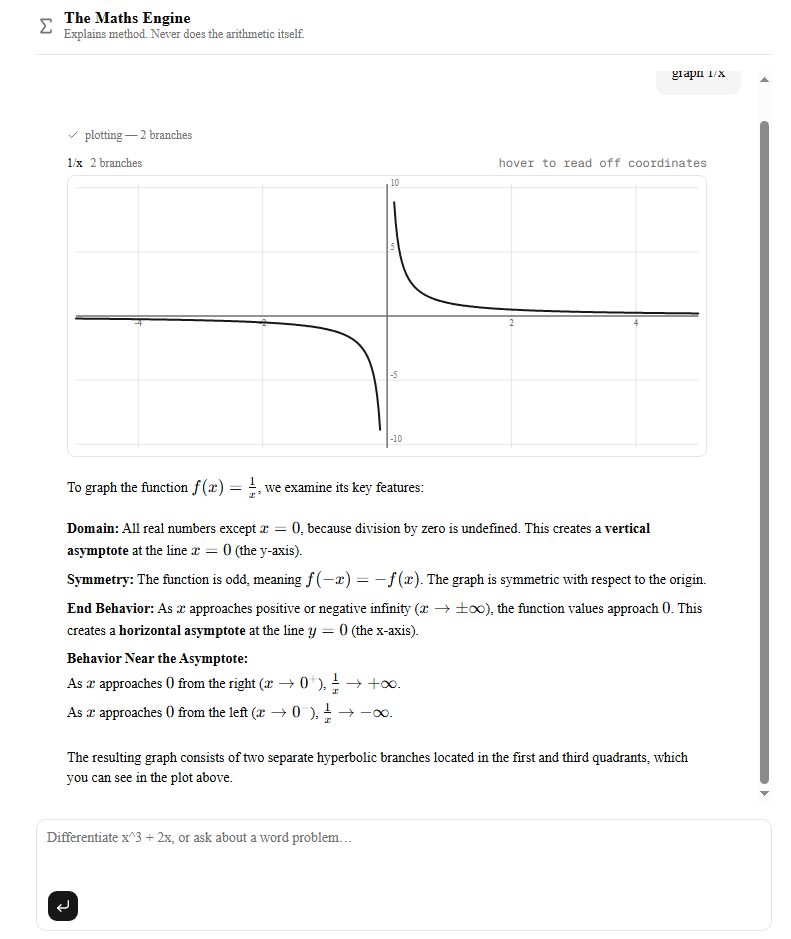
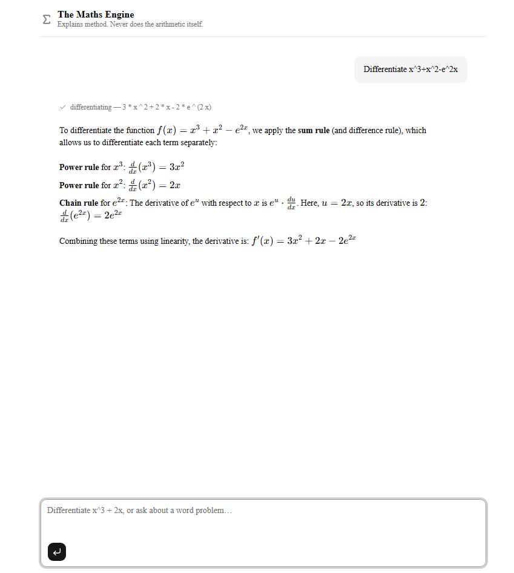

# The Maths Engine

An AI tutor for university level mathematicians that explains methods rather than just giving over answers to students. It never does arithmetic or algebra "in its head", every number or symbolic result it states comes back from a verified tool call. This means that what students see on screen has actually been computed, not guessed by the language model. For worded problems, it states its interpretation and assumptions and asks the student to confirm them before calculating.

It can also search a set of real course documents — the Edexcel A level Mathematics specification and a set of KCL past papers with solutions — and it cites the filename of every document it uses. When the documents do not cover a question, it says so instead of answering from memory.

Built with Next.js and the [eve](https://www.npmjs.com/package/eve) agent framework, running Gemini as the underlying model, with retrieval on Cloudflare Workers AI and Vectorize. Conversations are durable eve sessions, so refreshing the page keeps your working out — and a turn still running when you closed the tab is picked back up.

## Tools

Five tools, all of them in `agent/tools/`. eve discovers them from that folder; there is no registry to keep in sync.

**`calculate`** — the general-purpose one. Give it an expression like `"x^3 + 2x"` and tell it what to do with it: evaluate it (optionally plugging in values, e.g. `x = 2`), differentiate it with respect to a variable, or simplify it. It hands back the exact result, a decimal version when that's useful, and a short note on how it got there.

**`number_theory`** — for whole-number questions: is this prime, what are its prime factors, what's the greatest common divisor or lowest common multiple of two numbers, what's the remainder. Give it one or two integers and which of those you want, and it returns the answer along with the reasoning, e.g. `12 = 2^2 x 3`.

**`plot_function`** — turns an expression into a graph. Give it a function, a variable, and a range to plot over, and it samples the curve and draws it in the chat, splitting it into separate pieces wherever the function breaks (like at an asymptote).

**`search_documents`** — semantic search over the course documents. It embeds the question with Cloudflare Workers AI and asks Vectorize for the five closest chunks, then decides for itself whether any of them are actually relevant, returning a `verdict` of `found`, `uncertain`, or `none` along with the scores it judged on. Every chunk carries the filename it came from, so an answer can be traced back to a page. Requires the `CF_*` variables below; without them it reports that it is unconfigured and the rest of the app carries on working.

Retrieved facts are cited by filename. The instructions require it, and the sources panel above each answer lists every file the search returned with its relevance score — so a student can always see what the answer was built on, whether or not the prose names it.

**`remember_student`** — notes what is worth carrying across the conversation: the student's level or course, the topic they are working through, and mistakes they actually made. Those notes come back at the top of each later turn, which is what lets the tutor say "this is the same step you got wrong earlier".

Alongside these, the agent uses eve's built-in `ask_question` on worded problems, to lay out the assumptions it is making (starting height, direction, which constant to use) and get the student's confirmation before turning the words into an expression.

eve's `bash`, `agent`, `web_search`, `web_fetch`, `read_file`, `write_file` and `load_skill` tools are deliberately switched off, each with a one-line `disableTool()` file in `agent/tools/`. A shell or a web search would give the model a way to produce a number that did not come from a verified tool, which is the one thing this project promises it cannot do.

## Running it locally

Requires Node.js 20.12 or later.

```bash
git clone https://github.com/YuChen5470/my-agent.git
cd my-agent
npm install
```

Copy the example environment file and fill it in:

```bash
cp .env.example .env.local
```

### Environment variables

| Variable | Needed for | Where to get it |
| --- | --- | --- |
| `GOOGLE_GENERATIVE_AI_API_KEY` | every turn — the model itself | [Google AI Studio](https://aistudio.google.com/apikey) |
| `CF_ACCOUNT_ID` | `search_documents`, and ingest | Cloudflare dashboard, right-hand sidebar |
| `CF_API_TOKEN` | `search_documents`, and ingest | Cloudflare → My Profile → API Tokens → Create Token, with **Workers AI** and **Vectorize** edit permissions |
| `CF_VECTORIZE_INDEX` | `search_documents`, and ingest | the name you gave your Vectorize index |

Only the Google key is required to start. Leave the three `CF_` values blank and everything except document search still works; `search_documents` will report that it is not configured rather than crashing.

```bash
npm run dev
```

Open [http://localhost:3000](http://localhost:3000).

## npm scripts

| Script | What it does | When you'd run it |
| --- | --- | --- |
| `npm run dev` | Starts the Next.js dev server on port 3000 with hot reload. | Day-to-day, while working on the app. |
| `npm run build` | Production build — compiles the app and typechecks it. | Before deploying, and to check nothing is broken. |
| `npm start` | Serves an already-built app. | After `npm run build`, to check the production build locally. |
| `npm run lint` | ESLint over the source. | Before committing. Should be silent. |
| `npm run typecheck` | Generates Next's route types, then `tsc --noEmit` — types only, no build output. | For a fast type check without waiting for a full build. |
| `npm run eval` | Runs the eve eval suite in `evals/` against the live model. | After changing the instructions or a tool, to check the behaviour it guarantees still holds. Costs model quota. |
| `npm run rag:ingest` | Reads `corpus/`, chunks and embeds it, uploads to Vectorize. | Once at setup, and again whenever you add or change a document. |

## Building the document index

`search_documents` reads an index; it does not build one. Building it is `npm run rag:ingest`, and the whole pipeline is committed in `scripts/`.

**1. Create a Vectorize index.** It must be **768 dimensions** using **cosine** distance, matching the `@cf/baai/bge-base-en-v1.5` embedding model the pipeline uses. With [Wrangler](https://developers.cloudflare.com/workers/wrangler/):

```bash
npx wrangler vectorize create my-rag-index --dimensions=768 --metric=cosine
```

Put that index name in `CF_VECTORIZE_INDEX`.

**2. Put documents in `corpus/`.** The folder is empty in the repo — the papers it held are KCL exam material and are not mine to redistribute. [`corpus/README.md`](corpus/README.md) lists exactly which documents the deployed index was built from and where to get them. Any set of `.pdf`, `.md` or `.txt` files works.

**3. Run it.**

```bash
npm run rag:ingest
```

What it expects and what it does: it reads every `.pdf`, `.md` and `.txt` in `corpus/` (PDFs are parsed to markdown natively), splits each into 500-word chunks overlapping by 50, embeds them in batches of 20 through Workers AI, and upserts them to Vectorize keyed as `filename#chunkIndex`. Set `CHUNK_WORDS` and `OVERLAP_WORDS` to override the chunk sizes.

**Roughly how long:** about 87 chunks from ten documents took a few minutes, most of it spent in the upsert calls rather than the embedding. Vectorize is eventually consistent, so the script then polls until the index reports it has processed the final write — that wait alone is usually 45–70 seconds. Do not query the index before it finishes; a query run too early returns confident but wrong results.

**It is resumable.** Every chunk that lands is appended to `ingest-log.jsonl` immediately, and a re-run skips anything already logged. If it dies halfway, run it again. To force a full rebuild, delete that file.

## Evals

`evals/` holds five deterministic eve evals — no LLM judge, they assert on which tools were called and what those calls returned. They cover the behaviours the project's promise rests on: that trivial arithmetic still goes through a tool, that a chain-rule derivative is done by `calculate`, that number theory uses `number_theory`, that a plot splits at an asymptote, and that a word problem asks before computing.

```bash
npm run eval
```

They call the live model, so they spend Gemini quota.

## Screenshots




